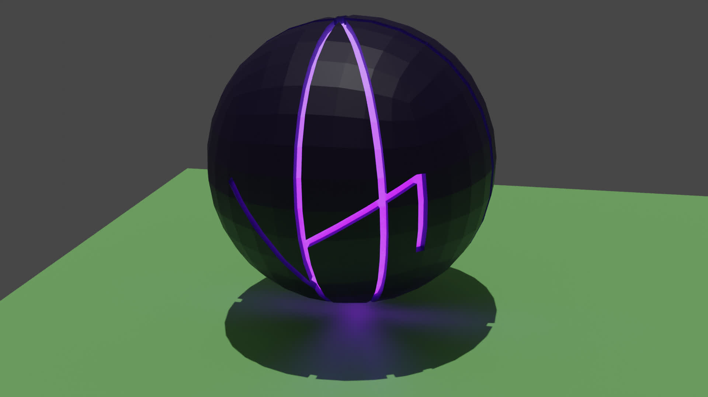

# Faded

## Table of contents

- [Timeline](#timeline)

## Timeline

### 700 years before the arrival (700ba)

- Strange meteor landed on the Earth, this meteor will latter be
  called [The Sphere](#the-sphere).

### 700-697ba

- Search for the meteor.

- When meteor landed on the Earth, it did not produce any explosion, therefore
  it took full 3 years to find its landing spot.

### 697ba

- Meteor location has been found.

- Meteor was named [The Sphere](#the-sphere) by one of the explorers.

- Strange forest grow around [The Sphere](#the-sphere). This forest will later
  be named [Tadia](#the-sphere-forest---tadia)
  by members of [The Cult](#the-cult---ankymans).

### 697-690ba

- Chain of failed experiments, trying to open
  [The Sphere](#the-sphere) and cut the trees near it.

### 696ba

- All human tools are ineffective. [The Sphere](#the-sphere)
  could not be mined. Strange trees around it could not be cut.

- Humans event attempted to dig the tree from the ground, but tree roots are
  enormously deep.

- Secret society of the humans proposes a construction of
  [The Impact Hammer](#the-impact-hammer), which will use some secret
  technology, able to split [The Sphere](#the-sphere)
  into parts.

### 695ba

- Started the construction of [The Impact Hammer](#the-impact-hammer)
  which uses a secret human technology, powerful enough to
  split [The Sphere](#the-sphere) into parts.

### 693ba

- Strange behavior of the leaf's from the trees in
  [The Sphere Forest](#the-sphere-forest---tadia) is discovered.

### 690ba

- [The Impact Hammer](#the-impact-hammer) construction was completed and hammer
  was activated. Once it hit
  [The Sphere](#the-sphere), The Sphere was indented into Earth and large
  explosion happen. It obliterated The Impact Hammer and killed almost everyone
  near The Sphere.

- Small crack appeared on The Sphere.

- The Sphere Project was abandoned.

- First signs of [The Cult](#the-cult---ankymans) started appearing. Its members
  will later name themselves Ankymans.

### 689ba

- [The Cult](#the-cult---ankymans) is becoming larger.
- Ankymans think that The Sphere is a divine being sent by the God.

## The Sphere

It is the meteor which landed on the Earth 700ba. When the meteor hit the
atmosphere, it shined with a bright purple color which illuminated the sky on
the whole globe. Once the meteor went behind the horizon, everyone who saw it
started panicking, thinking about the worse, but actually nothing happen. There
was no explosion. It took human explorers a full 3 yeas to find the landing spot
of the meteor. "The sight was like nothing I have event seen before" said on of
the explorers.

Because of it shape, the meteor was named The Sphere. It is around 8 meters in
diameter with a very dark purple color (something like the obsidian) and
geometric lines indented into it, forming some sort of symbol.

The Sphere is the core of a planet where Anky came from. It is very hard and
heavy, but for being what it is, The Sphere is actually surprisingly small and
inactive. It is still unknown what size the planet was. It landed on the Earth
after the explosion of the Anky home planet, which was destroyed in the war
with the [Fade race](#fade-race).

Little is known about The Sphere and how it works, but it can convert energy
into matter and matter into energy, which Anky can also do. Anky thought humans
how to horniest this power and use it to make weapons and tools.

The Sphere is also the center of knowledge for the Anky. Once Anky is born
from a seed of the [Sui tree](#sui-tree), The Sphere will transfer all past
knowledge to it, and once an Anky dies, it will take knowledge back. Anky speak
using some sort of telepathy. Thoughts are converted into energy which is sent
to the roots of the Tadia forest; via the roots it is transferred to The
Sphere and then to the Anky which is receiving the message.

## Anky

## The Sphere Forest - Tadia

## Sui Tree

## The Cult - Ankymans

## The Impact Hammer

## Fade Race
