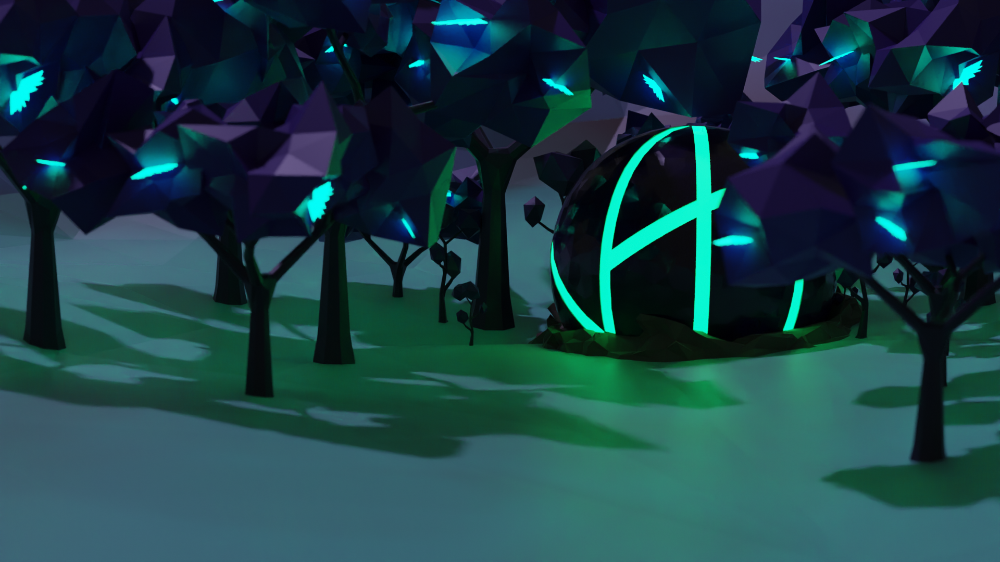

# Faded

## Table of contents

- [Timeline](#timeline)
- [The Sphere](#the-sphere)
- [Anky](#anky)
- [The Sphere Forest - Tadia](#the-sphere-forest---tadia)
  - [Sui tree](#sui-tree)
- [The Cult - Ankymans](#the-cult---ankymans)
- [The Impact Hammer](#the-impact-hammer)
- [Fade race](#fade-race)
- [Character classes]()
  - [Rogue]()
    - [Archer]()
    - [Assassin]()
  - [Memist]()
    - [Enhancer]()
    - [Meister]()
  - [Gladiator]()
    - [Berserk]()
    - [Duelist]()
  - [Knight]()
    - [Guardian]()
    - [Paladin]()
  - [Shaman]()
    - [Ankyman]()
    - [Caster]()

## Timeline

### 700 years before the arrival (700ba)

- Strange meteor landed on the Earth, this meteor will latter be called [The Sphere](#the-sphere).

### 700-697ba

- Search for the meteor.
- When meteor landed on the Earth, it did not produce any explosion, therefore it took full 3 years to find its landing spot.

### 697ba

- Meteor location has been found.
- Meteor was named [The Sphere](#the-sphere) by one of the explorers.
- Strange forest has started growing around [The Sphere](#the-sphere). This forest will later be named [Tadia](#the-sphere-forest---tadia) by members of [The Cult](#the-cult---ankymans).

### 697-690ba

- Chain of failed experiments, trying to open [The Sphere](#the-sphere) and cut the trees near it.

### 696ba

- All human tools are ineffective. [The Sphere](#the-sphere) could not be mined. Strange trees around it could not be cut.
- Humans attempted to dig the tree from the ground, but tree roots are enormously deep and entangled.
- Secret society of humans proposes a construction of [The Impact Hammer](#the-impact-hammer), which will use some secret technology, able to split [The Sphere](#the-sphere) into parts.

### 695ba

- Started the construction of [The Impact Hammer](#the-impact-hammer) which uses a secret human technology, powerful enough to split [The Sphere](#the-sphere) into parts.

### 693ba

- Strange behavior of the leaf's from the trees in the [Tadia](#the-sphere-forest---tadia) forest is discovered and further research is being conducted.

### 690ba

- [The Impact Hammer](#the-impact-hammer) construction was completed and hammer was activated. Once it hit [The Sphere](#the-sphere), The Sphere was indented into Earth and large explosion happen. It obliterated The Impact Hammer and killed almost everyone near The Sphere. Interesting thing was that all [Tadia](#the-sphere-forest---tadia) forest trees were intact.
- Small crack appeared on [The Sphere](#the-sphere).
- The Sphere Project was abandoned.
- First signs of [The Cult](#the-cult---ankymans) started appearing. It members will later name themselves [Ankymans](#the-cult---ankymans).
  
### 689ba

- [The Cult](#the-cult---ankymans) is becoming larger.
- Ankymans think that The Sphere is a divine being sent by the Gods.

## The Sphere

It is the meteor which landed on the Earth 700ba. When the meteor hit the atmosphere, it shined with a bright purple color which illuminated the sky on the whole globe. Once the meteor went behind the horizon, everyone who saw it started panicking, thinking about the worse, but actually nothing happen. There was no explosion. It took human explorers a full 3 yeas to find the landing spot of the meteor. Once the explorers reached the meteor: "The sight was like nothing I have event seen before"; said on of the explorers.

Because of it shape, the meteor was named The Sphere. It is around 8 meters in diameter with a very dark purple color (something like an obsidian) and geometric lines indented into it, forming some sort of symbol.

The Sphere is the core of a planet where [Ankys](#anky) came from. It is very hard and heavy, but for being what it is, The Sphere is actually surprisingly small and inactive. It is still unknown what is the size of a planet where they came from. It landed on the Earth after the explosion of the Ankys home planet, which was destroyed in the war with the [Fade race](#fade-race).

Little is known about The Sphere and how it works, but it can convert energy into matter and matter into energy, which Anky can also do. Anky thought humans how to horniest this power and use it to make weapons and tools.

The Sphere is also the center of knowledge for the Anky. Once Anky is born from a seed of the [Sui tree](#sui-tree), The Sphere will transfer all past knowledge to it, and once an Anky dies, it will take the knowledge back. Anky speak using some sort of telepathy. Thoughts are converted into energy which is sent to the roots of the Tadia forest; via the roots, message is transferred to The Sphere and then to an Anky which is receiving it.

It is known that The Sphere is creating the [Tadia forest](#the-sphere-forest---tadia) around it. After [the impact hammer](#the-impact-hammer) indented it into the Earth, Tadia forest started growing and spread at greater speed. It is hypothesized that, if The Sphere was completely submerged into the Earth, the whole Earth will be covered in the Tadia forest. This fact is concerning some humans and will result in [The Great War](#the-great-war)

## Anky

Anky are a race from a planet somewhere in the universe. They are born from the seeds of the [Sui tree](#sui-tree) as adults and do not change appearance over the course of their life. Once Anky is broth to life, it will inherit the past knowledge of [The Sphere](#the-sphere) and when Anky dies, it will transfer its knowledge back to The Sphere.

Just like The Sphere, Anky can convert matter into energy and vice versa. It is not well understood how this process occurs but Anky can perform it with their bodies, while tools crafted from the [Chorus Crystal](#chorus-crystal) and the [Tadia](#the-sphere-forest---tadia) tree roots can massively amplify the effect. With the help of Anky, humans developed tools which can harness part of this power.

Not much is known about the Anky history because of the damage on The Sphere, made by [the impact hammer](#the-impact-hammer). Anky born on the Earth can remember that there was a huge war on their home planet with the [Fade race](#fade-race) which Anky lost, resulting in the planet destruction. It is hypothesized that planet size explosion ejected the planet core, The Sphere, into the space and after millions of years, it landed on the Earth.

Anky are friendly race and never had wars, and because of this, they never developed any kind of weapons. Over the course of millions of years they practiced techniques of matter and energy warping and perfected it, making very advanced tools for medicine.

Average Anky lives around 500 years and is between 1.4 to 1.6 meters high. Their constitution is very similar to humans; they have genders, but it is not understood why since they cannot reproduce. They are covered in something like human skin, but it is pail, much harder and very smooth, with little imperfections. They never developed the language because they communicate using some sort of telepathy, using The Sphere and Tadia tree roots, even though, they can produce complex sounds. Anky were thought how to communicate using voice on the Earth by the [Ankymans](#the-cult---ankymans) and they are using the voice to communicate with each other, when outside the Tadia and with humans.

Anky communication is very interesting. Telepathy communication can occur only inside of the Tadia forest.

## The Sphere Forest - Tadia

Named Tadia by [Ankymans](#the-cult---ankymans), it refers to the area around [The Sphere](#the-sphere), which is becoming larger and spreading each year.

Tadia is full of weird trees and plants with [Chorus Crystals](#chorus-crystal) growing near the tree roots. Air in it is tick and has purple pigment, probably caused by the glowing Chorus Crystals. Tree bodies are very dark purple color, similar to the color of The Sphere, with bright turquoise leaves, which are glowing softly at night.

### Sui Tree

## Chorus Crystal

## The Cult - Ankymans

## The Impact Hammer

## Fade Race

## The Great War

## Character classes

### Ranger
